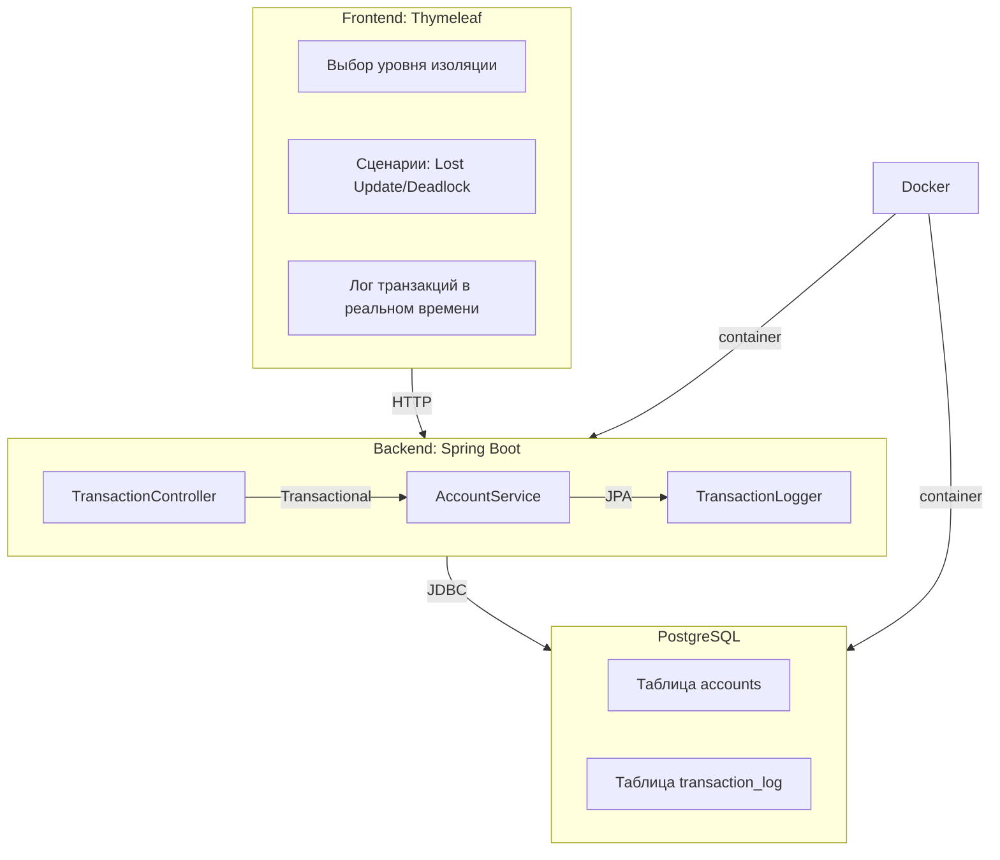

# TransactionVisualizer  
**Визуализация работы транзакций в PostgreSQL с уровнями изоляции и блокировками**  

---

### **О проекте**  
Этот проект демонстрирует, как работают транзакции в PostgreSQL, наглядно показывая:  
- Уровни изоляции (`Read Committed`, `Repeatable Read`, `Serializable`).  
- Конфликты: `Dirty Read`, `Non-Repeatable Read`, `Phantom Read`, `Deadlock`.  
- Блокировки (оптимистичные/пессимистичные) и их влияние на параллельные операции.  

**Для кого:**  
- Junior/Middle разработчики, готовящиеся к собеседованиям.  
- Преподаватели курсов по базам данных.  
- Команды, тестирующие сценарии параллельных операций.  

---

### **Ключевые особенности**  
- **Поддержка уровней изоляции** через `@Transactional` (Spring Boot).  
- **Симуляция конфликтов** с помощью веб-интерфейса.  
- **Логирование SQL-запросов** и блокировок в реальном времени.  
- **Готовые сценарии**: Lost Update, Phantom Read, Deadlock, Lost Update.  

---

### **Технологический стек**  
- **Backend**: Spring Boot, JPA/Hibernate, PostgreSQL.  
- **Frontend**: Thymeleaf.  
- **Инструменты**: Liquibase (миграции), Docker (развертывание).  

---

### **Шаги выполнения:**  

1. Настроить окружение (Java, Docker, CI/CD).
2. Инициализировать БД через Liquibase.
3. Создать сущности.
4. Реализовать TransactionExecutor (параллельные транзакции + обработка ошибок).
5. Логирование блокировок (триггеры PostgreSQL).
6. Создать REST API (интерфейс для данных).
7. Формы для изменения данных.
8. Визуализация конфликтов.
9. Лог выполнения (вывод в реальном времени).
